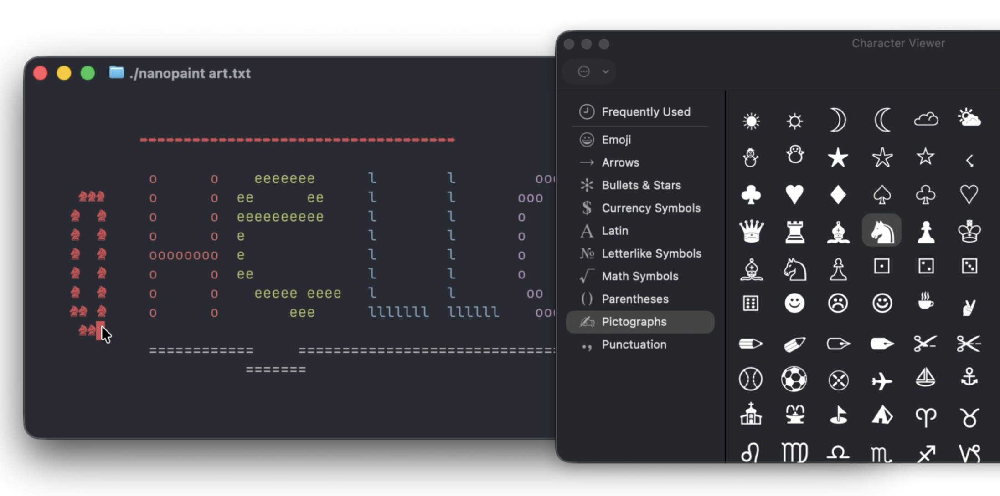

# Nanopaint

Very small ASCII paint



**Build with**:

```
clang -O3 -Wall -Wextra -o nanopaint nanopaint.c
./nanopaint myart.txt
```

**Usage**:
- 0-9 are colors (0=black 1=red 2=grn 3=yel 4=blu 5=mag 6=cyn 7=wht 8=brblk 9=brred)
- click-drag to paint

**TODO**: 
- [ ] Save to file even if it doesn't exist
- [ ] Motions
- [ ] Modularize a bit more
